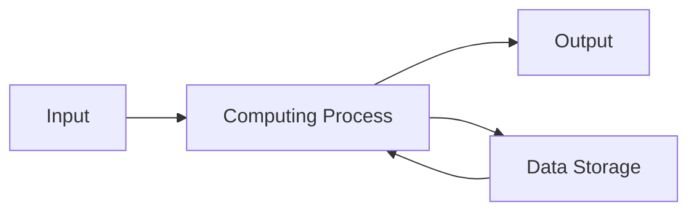
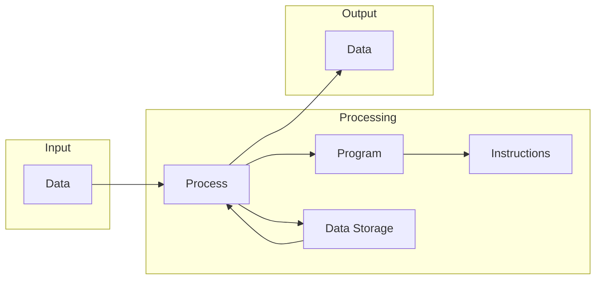
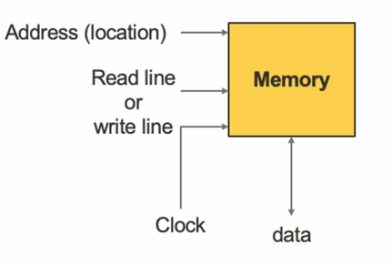

# Lecture1

> ### Computing Process - The User’s Point of View

* ###  The Input-Process-Output Model (IPO model)

#### Basic process has three steps:
* Read input data
* Process data
* Write output data

#### Computing process
* Computer program that is being sequentially executed by a computer

#### Data storage
* Store data
* Retrieve data

---
##  Programmable computers

> ### What is programmable computers
* Programming is putting instructions together meaningfully

*  Programmable computer can execute instructions
    
    * Instead of executing a fixed process

* Another composition of instructions, another process

* Programming can be done by
    *  End-users (without real programming knowledge)
    * Computer programmers

> #### Programmability
* Degree of how a system can be programmed

* Low programmability
    * Some flexibility in adjusting the computing process
    * Vacuum robots, vehicle navigation systems

* High programmability
    *  Re-purposed to serve a larger range of processes
    *  Modern desktop computers, smartphones and tablets

>### How to achieve high programmability?
* A large amount of instructions available
*  A high flexibility to compose and sequence the instructions
* Short time and little effort to re-program a system

>### What is programmable computers
 * Programming is putting instructions together meaningfully
 * Programmable computer can execute instructions
    *  Instead of executing a fixed process
*  Another composition of instructions, another process
*  Programming can be done by
    *  End-users (without real programming knowledge)
    *  Computer programmers

---

## Components of programmable computers

>#### Programmable enabled processes

 * Instruction execution
    * An essential function of the programmable computer
 * Data storage
    * A function for storing the data before and after the instruction execution
 * Program storage
    * A function for storing the program in the programmable computer for instruction execution
 * Inputting data
    * Data (including program) that a computer receives
 * Outputting data
    * Data that a computer sends

>### Be a useful computing process
 * MUST include input and output for interacting with the outside world

>### Major components of a programmable computer

 * Arithmetic and Logic Unit (ALU)
    * For instruction execution
 * Memory system
    * For data and program storage
 * Input device
    * For data input (including program) into the programmable computer
 * Output device
    * For data output from the programmable computer

>### Arithmetic and Logic Unit (ALU)
 * Functional unit for instruction execution
    * ALU accepts data and instructions
    * ALU produces data output which is a result of instruction execution
 * Fundamental building block of computing circuits (e.g. CPU, GPU)

 * Most ALU has two data input ports
    * Input data to be operated on, called operands
 * ALU operation is controlled by the instruction port
    * The instruction operated on the data presented at the input ports
    * The code presented at instruction port mapped to a particular instruction
 * ALU operation timing is controlled by the clock port
    * A clock signal is provided to control when operations take place

>### Memory
 * Functions of memory
    * Retrieve data (Read)
    * Store data (Write)
    * Overwrite a previously stored data (Overwrite)

 * Duplex data channel
 * Read/write line
 * Clock line
 * Data operations involve a data unit
    * The size of data unit varies: bit, byte
 * Address to identify each data unit in memory
    * Numbered 0 onwards
    * Number of addresses determine the size of memory system
    * Address specifies which data unit for the current operation
