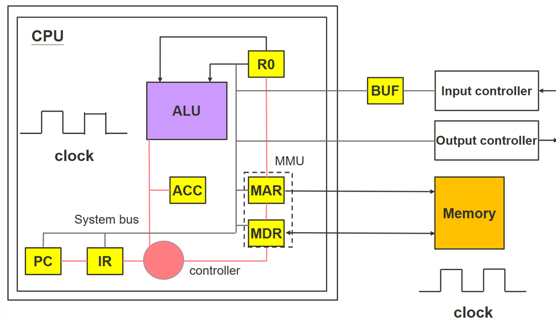

# lecture 4 

> #### Current ALU design

> #### First design of programmable computer

* Arithmetic and Logic Unit (ALU)
    * Obtain instructions and data from the memory
    * Execute instructions and operations
 * Registers (Yellow box in the previous slide)
    * Fast data storage (e.g. intermediate results and instructions)
    * Interfacing between components
 * Memory 
    * Storage and retrieval of dataArithmetic and Logic Unit (ALU)
    * Obtain instructions and data from the memory
    * Execute instructions and operations
 * Registers (Yellow box in the previous slide)
    * Fast data storage (e.g. intermediate results and instructions)
    * Interfacing between components
 * Memory 
    * Storage and retrieval of data
* Controller
    * Coordinate and control the operations of components
    *  Also named as control unit, or micro-controller
* System bus
    * Data exchange between ALU and the registers
* Clock
     * Synchronize the works of the components``

>#### Von Neumann Architecture
* Specify the storage of program and data in the Memory System
    * Flexible to re-programme
    * Readily accessible by electronic signals
    * Stored indefinitely in memory
    * Programs modify themselves in operation
        * Programs code is simply data in memory cells
    * Stored programs allow the likes of compilers and interpreters possible
        * Purpose of these programs is to write programs

* Program code is stored in memory 
* Systems bus supports data movement from memory to IR
* Controller moves an instruction to IR by
    * Controller sends the address (containing the next instruction) to MAR
    * Memory system retrieves the data of the address. The data is sent to the MDR
    * Controller moves the instruction from MDR to IR

>### Introducing program counter into CPU design(PC)

#### System bus connects all registers in the programmable computer

