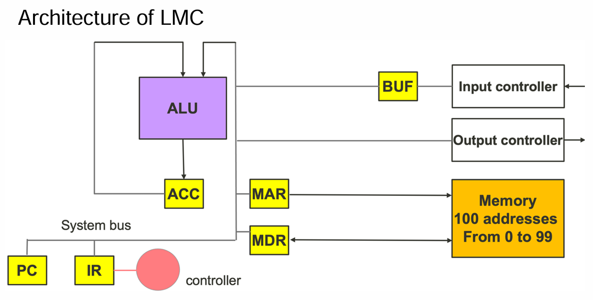

#  lecture 5.1

>#### Little Man’s Computer (LMC)

 *  LMC is an operational computer
 * LMC is a decimal based computer
    * Data and instructions follow positive decimal representation in ALU, registers, and memory 
system
 * Remove R0
 * ACC manages Addition/Subtraction operation
    * Another operation will be managed by MDR

>#### Major features of the LMC

* Three-digit decimal representation
* The registers hold 3-digit positive decimal
* The ALU supports addition and subtraction
  * Overflows are not reported
  * Carry is discarded
* ALU sends two types of status to ACC
  * Zero
  * Positive
* Memory system has 100 addresses, from 00 to 99
  * Each address stores a 3-digit positive decimal

> #### Mnemonics

---

>#### Benefits of Von Neumann Architecture

 * Simpler computer design
    * Single memory system for data and program instructions
 * Self-modifying instruction
    * Allow programmer to write instructions that modify instructions during execution
    * Programmer can create other instructions during execution
    * Reduce program size
    * Improve programmability

> #### Hazards of Von Neumann Architecture

* No indicator to signify whether it is an instruction or data
* Only programmer has knowledge and can take care the LMC
* A fetched instruction is assumed to be valid
  * If invalid (e.g. 903), cause a system exception
  * A data (e.g. 512) coincides with a valid instruction
    * The LMC cannot tell one from another
* Constants in LMC programs can also be instructions
  * It can be used as the stem of a self-modifying instruction

> #### Bottlenecks of Von Neumann Architecture
 * Program or data only
    * Connection between CPU and Memory carries both data and program
 * Data not ready
    * Instructions cannot be executeD (example LDA 77)
 * The limited throughput between CPU and memory