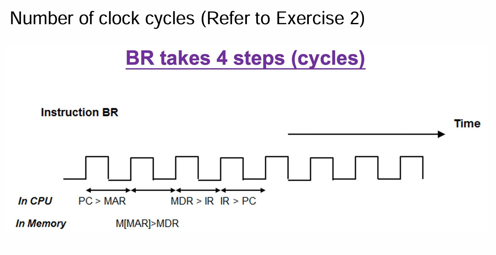

# lecture 5.2

>#### Programmable computer design

> #### Cycle of instruction execution

LMC in operation is in a cycle
 * Each cycle executes one instruction
 * Each cycle has two parts
    * Part 1: Fixed. Regardless of the instruction type
    * Part 2: Dependent on the instruction type

>Cycle of instruction execution (1st Part)

1. Move data from the PC to the MAR
    * Inform the memory system to load the next instruction
 2. The memory system gets the data and send to MDR
 3. The controller moves the data from MDR to IR

>  Cycle of instruction execution (2ndPart)

1. The controller checks the IR and acts based on the instruction
 2. The controller moves the address of the instruction from IR to MAR
 3. The memory system gets the data and send to MDR
 4. The controller moves the data from MDR to ACC

>Common data movement patterns

* PC to MAR (the address of next instruction)
* Memory System to MDR (memory read data)
* MDR to Memory System (memory write data)
* MDR to IR (the current instruction)
* MDR to ACC (data)
* ACC to MDR (data)
* MDR to MAR (memory address)

> #### Example (LDA instruction)

1. Controller moves the address in the PC to the MAR
 2. Memory system gets the data and sends it to the MDR
 3. Controller moves the instruction from MDR to IR
    * The instruction contains opcode and address operand
 4. Controller signals the PC to increase by one
5. Controller examines the opcode and knows that it is an LDA instruction
 6. Controller signals the IR to send the address operand to MAR
    * Also, it sets the R/W line of the memory system to “Read”
 7. The memory system reads the data and sends it to MDR
 8. Controller signals to MDR to move the data to the ACC

 Note: After the last step, the computer operation returns to the first step to execute the next instruction

---

>#### Notations in register transfer language

 * Capitalized names: components
    * ACC, R0, PC, IR, MAR, MDR
 * Square brackets [ ]
    * A part of a register or the address of memory
    * IR[Address] is the content of the IR
 * The (equals sign =) is the value of a component 
    * Memory[3] = 20
 * The (-> sign) indicates data movement
    * MDR -> Memory[3]  

`(Example 1)`
* Fetch of an instruction
* Put the instruction into the IR

| Instruction      | Description                                 |
|------------------|---------------------------------------------|
| PC -> MAR        | Transfer the instruction address to MAR     |
| M[MAR] -> MDR    | Read the current instruction                |
| MDR -> IR        | Copy the instruction to IR                  |
| PC + 1 -> PC     | Point to the next instruction               |

`(Example 2)`
 * Execute an instruction of ADD A, ACC
 * Add data of memory address A to ACC
 * Store the result of addition in ACC

| Instruction                | Description                                    |
|----------------------------|------------------------------------------------|
| PC -> MAR                  | Send instruction address to MAR                |
| M[MAR] -> MDR              | Read the current instruction                   |
| MDR -> IR                  | Copy the instruction to the IR                 |
| PC + 1 -> PC               | Point to the next instruction                  |
| IR[address field] -> MAR   | Send the operand address A to MAR              |
| M[MAR] -> MDR              | Read the operand from memory                   |
| MDR + ACC -> ACC           | Perform the addition and put it in the ACC     |

`(Example 3)`
* Write down the RTL for an instruction ADD R0, 4. The instruction adds the 
content of Memory Address 4 to R0.

| Instruction             | Description                                     |
|-------------------------|-------------------------------------------------|
| PC -> MAR               | Send instruction address to MAR                 |
| M[MAR] -> MDR           | Read the current instruction                    |
| MDR -> IR               | Copy the instruction to the IR                  |
| PC + 1 -> PC            | Point to the next instruction                   |
| IR[address field] -> MAR| Send the operand address A to MAR               |
| M[4] -> MDR             | Read the operand from memory #4                 |
| MDR + R0 -> R0          | Perform the addition and put it in R0           |

>Benefits of RTL

 * A clock signal controls the execution of RTL steps
    * One clock cycle per step
    * Work out the number of clock cycle per instruction
    * Work out if RTL steps carried out in parallel
 * RTL language can support micro-program
    * CPU Control Unit operates according to RTL steps

   

---

>#### Performance analysis of LMC

`Number of execution cycles`

| Mnemonics | Execution cycles | Memory operation |
|-----------|------------------|------------------|
| LDA       | 7                | 2                |
| STO       | 7                | 2                |
| ADD       | 7                | 2                |
| SUB       | 7                | 2                |
| INP       | 5                | 1                |
| OUT       | 5                | 1                |
| BRA       | 4                | 1                |
| BRZ       | 4                | 1                |
| BRP       | 4                | 1                |
| HLT       | 3                | 1                |

>#### LMC Performance Analysis

 * Number of execution cycles of each LMC instruction
    * Calculate speed of LMC program execution
 * Running time of a program
    * Total number of instructions executed
    * Composition of the instructions
 * If the instructions take fewer cycles to execute, program execution can be 
faster

>#### Execution speed of LMC program

`Question`: You have written an LMC program. In one execution of the program, 
you counted the number of instruction executed: there are 300 LDA or STO 
instructions, 120 ADD or SUB instructions, 20 BRA, BRZ, or BRP instructions, and 
5 INP or OUT instructions. If the CPU clock rate is 100 MHz, calculate the time 
taken to execute the program.  

`Answer`: The total number of cycles is calculated from the summation of number 
of cycles for each instruction.

of Cycles = 300x7 cycles + 120x7 cycles + 20x4 cycles + 5x5 cycles 
= 3045 cycles
 The clock rate is 100 MHz, which means 100 M cycles per second
 The time taken to execute the program is 3045/100M = 0.00003045 seconds

