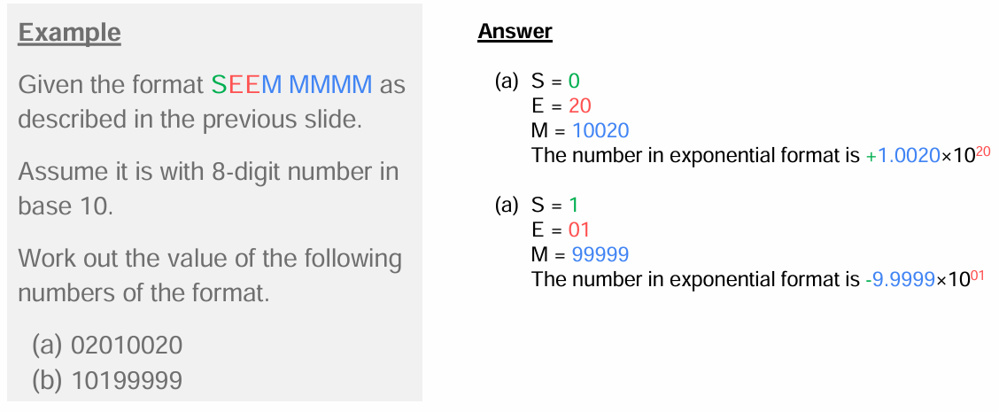
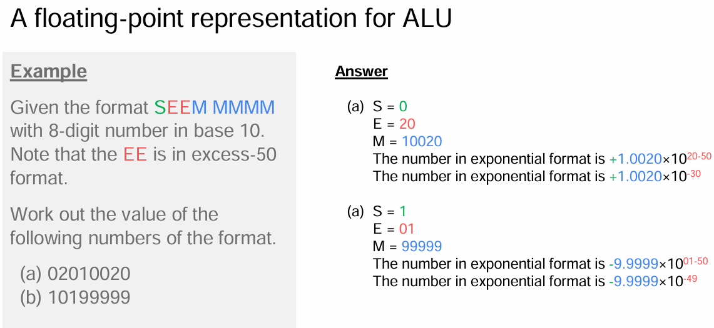
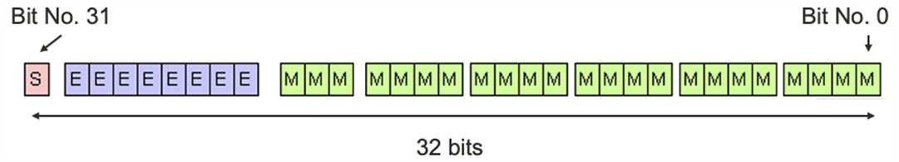
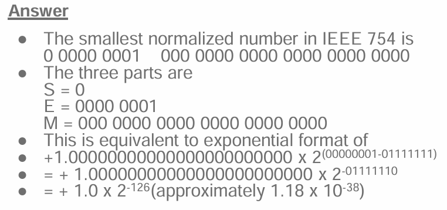

# lecture3

 ### Floating Point Representation

**Sign significant digits × baseex^(ponent)**

 * Sign (could be positive or negative)
 * Significant digits (also named as significand), in integer
 * Baseis an integer (at least 2), typically 2, 8, 10, 16
 * Exponent is an integer

| Number in Exp Representation | Value in decimal (precision is not indicated) | Sign | Exponent | No. of significant digits |
|------------------------------|-----------------------------------------------|------|----------|---------------------------|
| 1.23×10⁴                     | 12300                                         | +    | 4        | 3                         |
| 1.62001×10²⁴                 | 1620010000000000000000000                     | +    | 24       | 6                         |
| 5.2×10⁻¹⁸                    | 0.00000000000000000052                        | +    | -18      | 2                         |
| -2.3456×10⁰                   | -2.3456                                       | -    | 0        | 5                         |

---

> ### A Floating-point Representation for ALU

**Sign significant digits × baseex^(ponent)**

 * Symbol S indicates the sign
    * Digit 0 is positive
    * Digit 1 is negative
 * Symbol M indicates the mantissa digit
 * Symbol E indicates the exponent digits

 **8-bit: S M.MMMM × base^(EE)**

 

---

### IEEE 754 Representation

>#### IEEE 754 - Single precision (32 bits)
* Sign-bit (1-bit)
  * Bit No. 31
* Exponent bits (8-bits) in excess-127 notation and positive binary format
  * Bit No. 23 to 30
* Mantissa bits (23-bits)
  * Bit No. 0 to 22

Examples:

**<u>Normalized mode</u>**  
What is the smallest positive normalized number in IEEE 754 representation. 
Work out the exponential format accordingly.  

>### How to change **13.125** to bineary (IEEE 745 format)  
13 --> 1101  
0.125 --> 0.001 

1101 + 0.001 = 1101.001 = 1.101001 * 2^(3)

Exponent = 3 + 127 = 130 = 1000 0010

IEEE formet:   1.101001 ***take Numbers after the decimal point***  
0 10000010 10100100000000000000000

>### This number change to decimal 

1.101001 * 2 ^ (1000 0010-0111 1111)  
=  1.101001 *2 (3)  
= 1101.001   
= 13.125

[Click this is detail](https://davidhsu666.com/archives/ieee-754/)