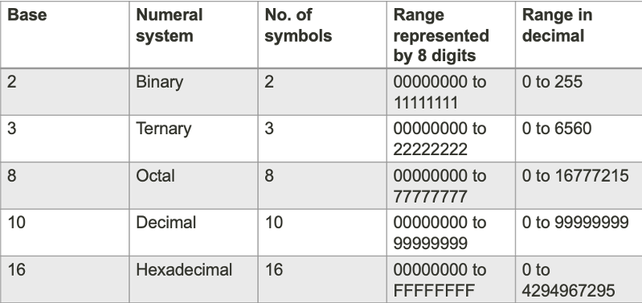
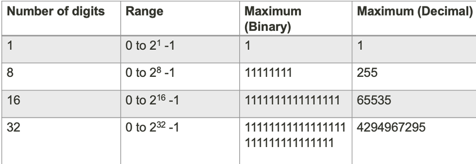

# lecture 2.1

>#### ALU Requirements

 * High Reliability
 * Error Free
 * Simple Design
 * Efficient Operation
 * Large Data Range
 * Economical Cost

## Binary number system

### Positional Notation

>#### Range of numbers representable depends on:

 * Number of symbols
 * Number of digits

 * More about binary and decimal numeral systems

>#### Representing Negative Numbers

 * Use a designated digit
    * For example: designate the left most position
        * 0111 (binary) represents -7 (decimal)
        * 1111 (binary) represents 7 (decimal)
    * Cost: an additional digit in every number

>#### How to convert decimal to binary
* exmaple:  
100/2 = 50 ... 0  
50/2 = 25 ... 0  
25/2 = 12 ... 1  
12/2 = 6 ... 0  
6/2 = 3 ... 0  
3/2 = 1 ... 1                  
1/2 = 0 ... 1        

 **Count the remainder from bottom to top you will get the 1100100 binary number**

 * other bases is a same

>#### Brief summary

* Use 2-level digital representation
  * Most error tolerant representation

* Binary numeral system uses two symbols 0 and 1 and the positional notation 
to represent positive values
  * A digit is a bit
  * There are 8 bits in a byte
  * An 8-bit binary number can represent 256 different values
  * If the smallest value is 0, then the range is from 0 to 255