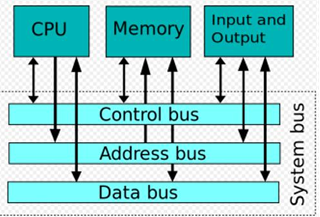
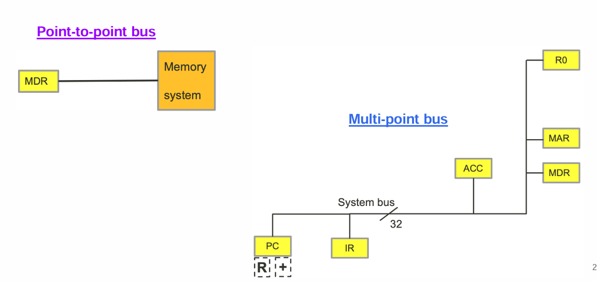

# lecture6.1

>#### Current Programmable computer design

> #### CPU Technologies

 * Execute instructions of computer program
 * Two core components
    * Arithmetic and Logic Unit (ALU)
    * Controller
 * Other components
    * Memory management unit (MMU)
    * Input controller
    * Output controller
    * Cache memory

---
## Bus Technologies

>#### Characteristics of Buses

 * System bus is only one of the many buses in a computer system
 * A bus consists of many lines, for the following purposes:
    * Data
      * Data line is binary encoded. It carries one bit of data at a time
    * Addressing
      * Address line is binary encoded. It carries one bit of data at at time
    * Control
      * Control line is binary encoded. Data on control line is a signal
      * E.g. Controller sends a signal to PC
    * Power
      * Computer system supplies stable voltage

  

  >####  Bus throughput

  * Theoretical throughput of a multi-line bus
    * Bus Throughput = Number of Lines * Data Rate per Line
 * Bus throughput depends on
    * Data transfer rate
    * Number of lines (or bits)
    * Overhead of protocols (encoding)
    * Distance between connected devices
    * Addressing and control

    

 >`Bus throughput (Example 1)`

 **Question:** Assume each data line transfer 1 bit in 200 ns. Calculate the 
throughput if the bus has a total of 32 lines.

`Answer:`

 Data rage per line = 1 bit / 200 ns = 5 Mbps

  Bus throughput = Number of lines * Data rate per line
  = 32 x 5 Mbps = 160 Mbps / 8  = 20 MBps

  >`Bus throughput (Example 2)`

  Some modern bus system supports multiple data movement in one clock rate
 E.g. Assisted Gunning Transceiver Logic (AGTL+) allows 4 transfers per cycle  

 **Question:** Given that an AGTL+ is running on a clock rate of 100 MHz. The bus is 
64 bits. Calculate the throughput.  

**Anwer:**
 Data rage per line = 100 Mbps x 4 transfers = 400 Mbps
 Bus throughput = Number of lines * Data rate per line
 = 64 x 400 Mbps = 25.6 Gbps / 8 = 3.2 GBps

> #### Point-to-Point Bus and Multi-point Bus

>#### Parallel bus

 * More than 1 data lines or data channels sending data at the same time
 * Transfer more than 1 bit at a time
 * Problem of clock skew
    * Signals of different data lines arrive at different time
 * Problem of crosstalk
    * Signals between data lines may interfere with each other

>#### Serial bus

 * Single data channel (sending 1 bit at a time)
 * Most common form of buses
    * Short and long(er) distance
 * Can outperform parallel bus
    * Running at a significantly fast clock rate
 * Cheaper in price

 | Feature           | Parallel Bus                              | Serial Bus                           |
|-------------------|-------------------------------------------|--------------------------------------|
| Data Transmission | Multiple bits simultaneously              | One bit at a time                    |
| Speed             | Faster over short distances               | Higher data rates over longer distances |
| Complexity        | More complex (multiple data lines)        | Simpler (single data line)           |
| Example           | PCI bus                                   | USB, SATA                            |
| Application       | Internal computer components              | External devices, long-distance communication |

